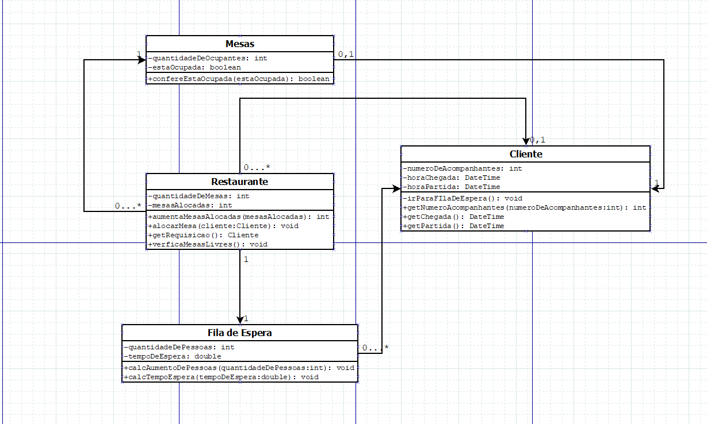
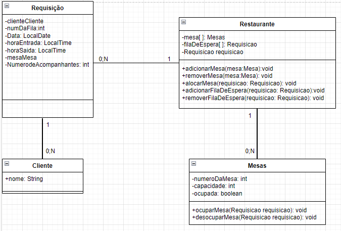
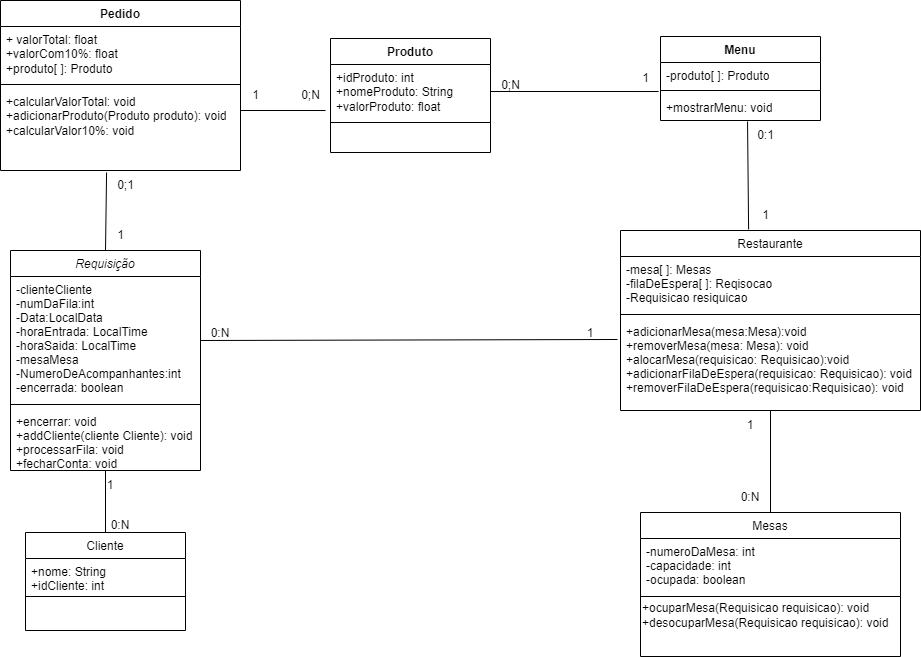
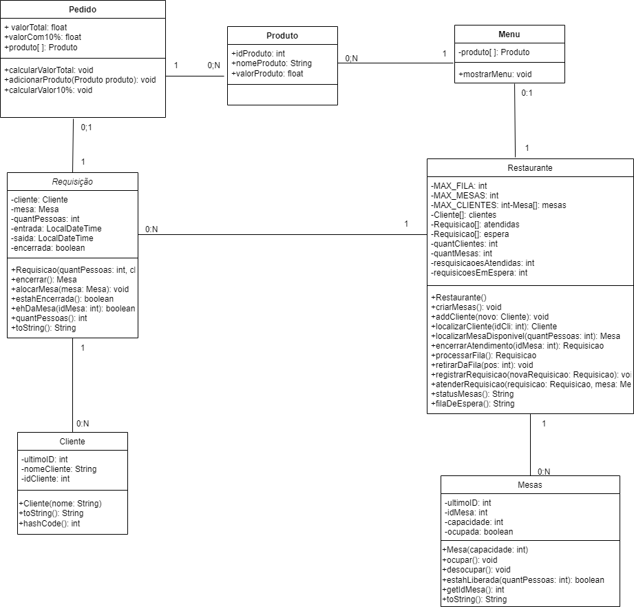
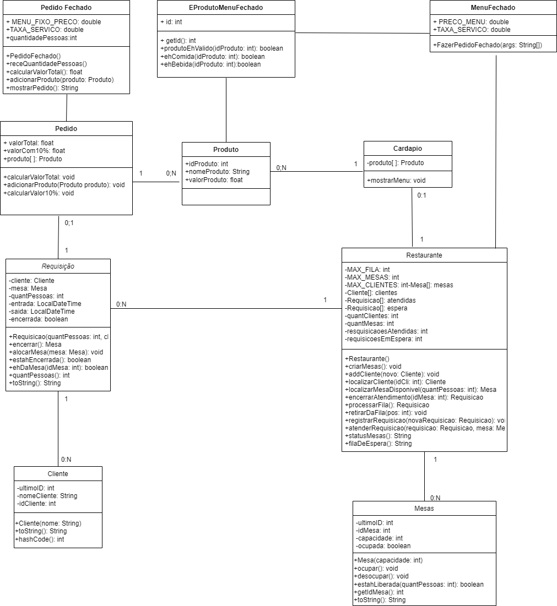

# Diagramas de classe
Coloque aqui todas as versões do seu diagrama de classes. Cada versão deve começar com um número de dois dígitos, na ordem crescente.

Versão 01
</img>

Versão 02

</img>

Versao 03

</img>

Versao 04

</img>

Versao 05
</img>